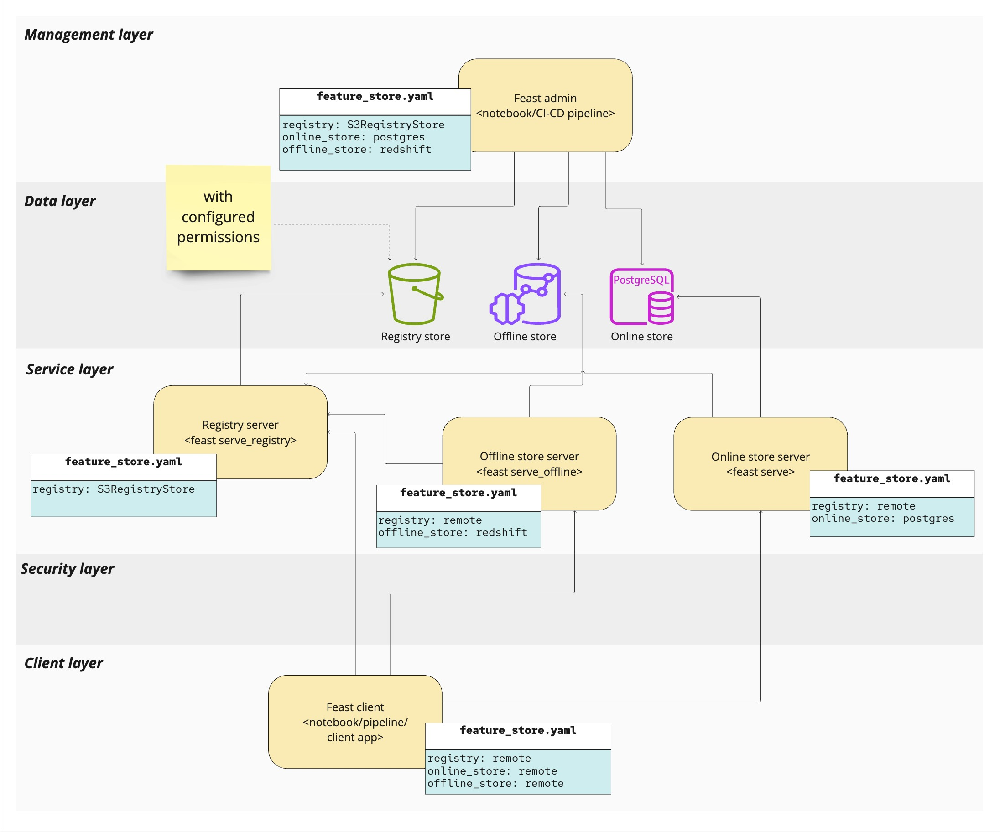

# Role-Based Access Control (RBAC) in Feast Feature Store

## Introduction

Role-Based Access Control (RBAC) is a security mechanism that restricts access to resources based on the roles of individual users within an organization. In the context of the Feast Feature Store, RBAC ensures that only authorized users or groups can access or modify specific resources, thereby maintaining data security and operational integrity.

## Functional Requirements

The RBAC implementation in Feast Feature Store is designed to:

- **Assign Permissions**: Allow administrators to assign permissions for various operations and resources to users or groups based on their roles.
- **Seamless Integration**: Integrate smoothly with existing business code without requiring significant modifications.
- **Backward Compatibility**: Maintain support for non-authorized models as the default to ensure backward compatibility.

## Business Goals

The primary business goals of implementing RBAC in the Feast Feature Store are:

1. **Feature Sharing**: Enable multiple teams to share the feature store while ensuring controlled access to data partitions. This allows for collaborative work without compromising data security.

2. **Access Control Management**: Prevent unauthorized access to team-specific resources and spaces, governing the operations that each user or group can perform.

## Reference Architecture

The Feast Feature Store operates as a collection of connected services, each enforcing authorization permissions. The architecture is designed as a distributed microservices system with the following key components:

- **Service Endpoints**: These enforce authorization permissions, ensuring that only authorized requests are processed.
- **Client Integration**: Clients interact with the feature store by automatically adding authorization headers to their requests, simplifying the process for users.
- **Service-to-Service Communication**: This is always granted, ensuring smooth operation across the distributed system.


## Permission Model

The RBAC system in Feast uses a permission model that defines the following concepts:

- **Resource**: An object within Feast that needs to be secured against unauthorized access.
- **Action**: A logical operation performed on a resource, such as Create, Describe, Update, Delete, query, or write operations.
- **Policy**: A set of rules that enforce authorization decisions on resources. The default implementation uses role-based policies.

### Configuring Permissions

Permissions in Feast are configured as follows:

- **Resource Identification**: Resources are identified by type, optional name patterns, and tags.
- **Allowed Operations**: Defined by the `AuthzedAction` enumeration, which specifies the actions that can be performed on the resource.
- **RBAC Policies**: These are specified by the list of required roles, which are then registered in the Feast Registry.

Example:
```python
Permission(
    name="ds-writer",
    types=[DataSource],
    required_tags={"risk_level": "hi"},
    actions=[AuthzedAction.WRITE_ONLINE, AuthzedAction.WRITE_OFFLINE],
    policy=RoleBasedPolicy(roles=["admin", "data_team"]),
)
```

### Enforcing Permission Policy

Authorization is enforced using assert-style code within service endpoint functions. Unauthorized requests result in a `PermissionError` or an HTTP 403-Forbidden response.

Example:
```python
assert_permissions(
    resource=feature_service,
    actions=[AuthzedAction.QUERY_ONLINE]
)
```

## Use Cases

### Tag-Based Permission
Permit team1 to access feature views `fv1` and `fv2` with role `role1`:
```python
Permission(
    name="team1-fvs",
    types=[FeatureView],
    required_tags={"team": "team1"},
    actions=[CRUD, WRITE, QUERY],
    policy=RoleBasedPolicy(roles=["role1"]),
)
```

### Name-Based Permission
Permit team1 to access feature views `fv1` and `fv2` with role `role1` using explicit name matching:
```python
Permission(
    name="team1-fv1",
    types=[FeatureView],
    name_filter="fv1",
    actions=[CRUD, WRITE, QUERY],
    policy=RoleBasedPolicy(roles=["role1"]),
)
```

## Authorization Architecture

The authorization architecture in Feast is built with the following components:

1. **Token Extractor**: Extracts the authorization token from the request header.
2. **Token Parser**: Parses the token to retrieve user details.
3. **Policy Enforcer**: Validates the secured endpoint against the retrieved user details.
4. **Token Injector**: Adds the authorization token to each secured request header.

### OIDC Authorization

OpenID Connect (OIDC) authorization in Feast is supported by configuring the OIDC server to export user roles within a JWT token. The client then connects to the OIDC server to fetch this token, which is parsed by the server to extract the user's roles.

Example configuration:
```yaml
auth:
  type: oidc
  client_id: _CLIENT_ID_
  client_secret: _CLIENT_SECRET_
  username: _USERNAME_
  password: _PASSWORD_
  realm: _REALM_
  auth_server_url: _OIDC_SERVER_URL_
```

### Kubernetes Authorization

In Kubernetes environments, all clients and servers run in the same cluster. The policy roles are mapped one-to-one with Kubernetes RBAC roles. The client injects the JWT token of its ServiceAccount, and the server extracts the service account name parsed from the token to look for the associated Role and ClusterRole.

Example configuration:
```yaml
auth:
  type: kubernetes
```


